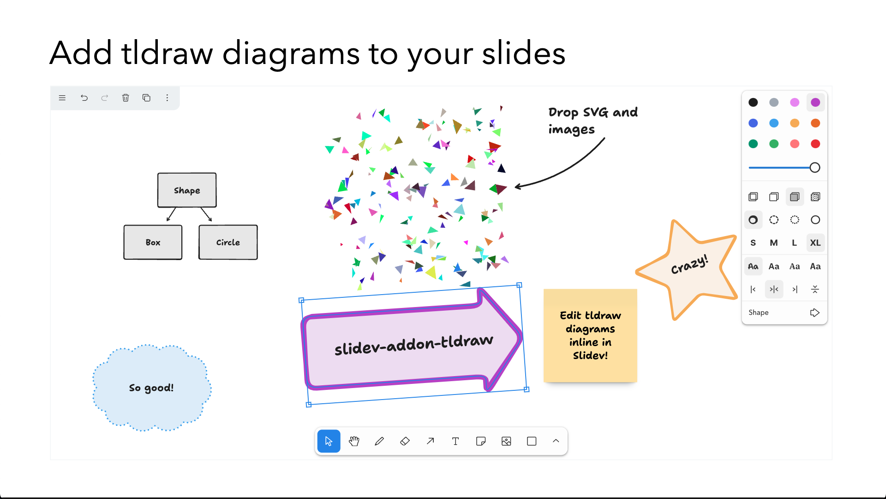

# tldraw for Slidev

Edit your [tldraw](https://tldraw.dev) diagrams directly in [Slidev](https://sli.dev/)



## Example with a new tldraw diagram

Add a new slide with the following content:

```md
---
# New tldraw diagram

<tldraw class="w-200 h-140" />
---
```

Make sure the diagram has a fixed width and height.

Now, start the slideshow in development mode. Navigate to the slide, add new shapes etc. The diagram content will be saved under the `public` folder and a reference is created automatically in the existing slide.

## Example for existing tldraw diagrams

Create a `public` folder, store the tldraw diagram in it and reference it in the slide:

```md
---
# Existing tldraw diagram

<tldraw class="w-200 h-140" doc="tldraw/example1.json" />
---
```

Note that the visible area is fixed to 800x800 for now.

## Features

Uploading assets is fully supported. Drop files on the tldraw component (or use the upload asset icon), then files are uploaded to the `public/tldraw/assets` folder and referenced in the diagram.

Note that some other `tldraw` options are disabled (for now). The addon makes a tradeoff between features and simplicity.

## Installation

Use your favorite package manager to install the addon:

```bash
pnpm add slidev-addon-tldraw
```

Then define this addon in the frontmatter of the slidedeck or in the `slidev` field of the `package.json`:

```yaml
---
addons:
  - tldraw
---
```

or

```json
 "slidev": {
    "addons": [
      "tldraw"
    ]
  },
```

## License

This addon is licensed MIT. Note that [the tldraw license](https://github.com/tldraw/tldraw/blob/main/LICENSE.md) is a custom license and only free for non-commercial use.
