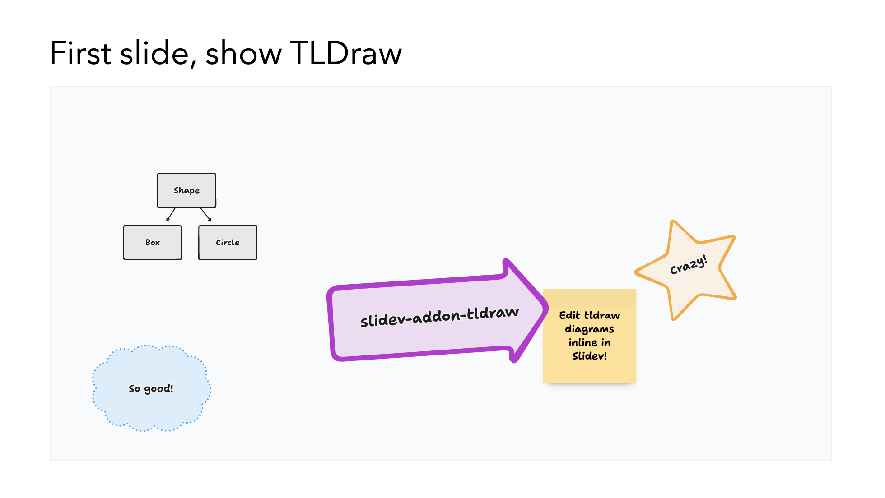

# tldraw for Slidev

Edit your [tldraw](https://tldraw.dev) diagrams directly in [Slidev](https://sli.dev/)



## Example

Add a new slide with the following content:

```md
---
layout: center
---

# New tldraw diagram

<Tldraw class="w-200 h-140" />
```

Make sure the diagram has a fixed width and height.

Now, start the slideshow in development mode. Navigate to the slide, add new shapes etc. The diagram content will be saved automatically as part of the existing slide.

Note that some `tldraw` options are disabled (for now). The addon makes a tradeoff between features and simplicity.

## Installation

Use your favorite package manager to install the addon:

```bash
pnpm add slidev-addon-tldraw
```

Then define this addon in the frontmatter of the slidedeck or in the `slidev` field of the `package.json`:

### Frontmatter

```yaml
---
addons:
  - tldraw
---
```

### package.json

```json
 "slidev": {
    "addons": [
      "tldraw"
    ]
  },
```

## License

This addon is licensed MIT. Note that [the tldraw license](https://github.com/tldraw/tldraw/blob/main/LICENSE.md) is a custom license and only free for non-commercial use.
