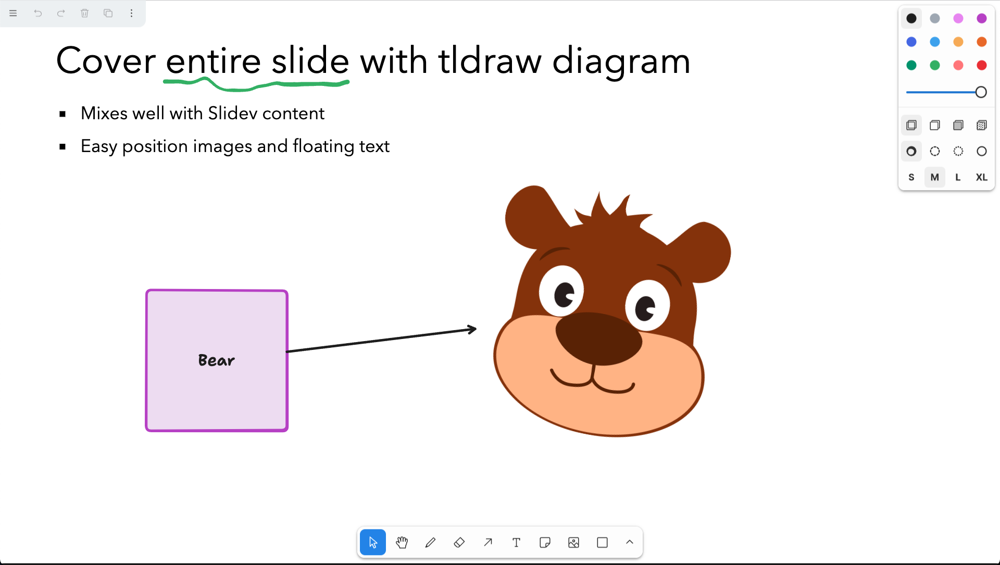
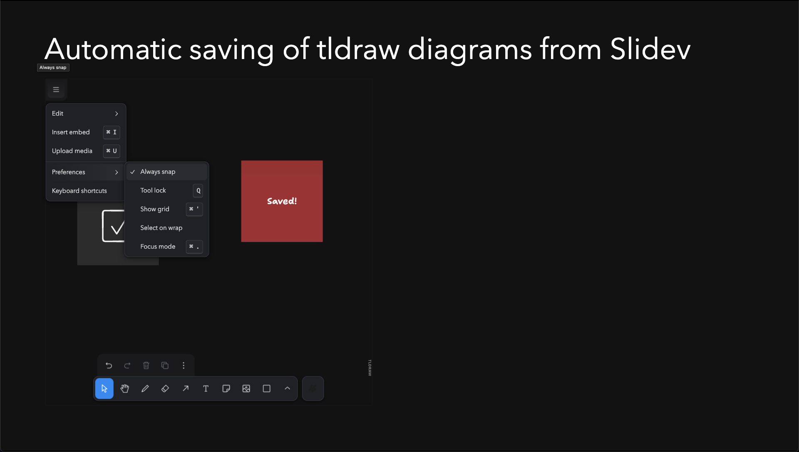

# tldraw for Slidev

Edit your [tldraw](https://tldraw.dev) diagrams directly in
[Slidev](https://sli.dev/)


## Installation

Use your favorite package manager to install the addon in your existing Slidev presentation, for instance using `pnpm`:

```bash
pnpm add slidev-addon-tldraw
```

Then define this addon in the frontmatter of the slidedeck:

```yaml
---
addons:
  - slidev-addon-tldraw
---
```

or in the `slidev` field of the `package.json`:

```json
 "slidev": {
    "addons": [
      "slidev-addon-tldraw"
    ]
  },
```

NOTE: you need to specify the full addon name since Slidev 52.x, not just `tldraw`.

## Example with a new tldraw diagram

Add a new slide with the following content:

```md
---
# New tldraw diagram

<tldraw class="w-200 h-140" />
---
```

Make sure the diagram has a fixed width and height. Check the
[Slidev UnoCSS docs](https://sli.dev/custom/config-unocss) on which classes are
available.

Now, start the slideshow in development mode. Navigate to the slide, add new
shapes etc. The diagram content will be saved under the `public` folder and a
reference is created automatically in the existing slide.

## Example for existing tldraw diagrams

Create a `public` folder, store the tldraw diagram in it and reference it in the
slide:

```md
---
# Existing tldraw diagram

<tldraw class="w-200 h-140" doc="tldraw/example1.json" />
---
```

Note that the visible area is fixed to 800x800 for now.

## Cover entire slide



If you want to cover the entire slide with a tldraw diagram, use the following
style:

```md
---
# Diagram covering entire slide

<tldraw class="inset-0 w-full h-full" />
---
```

## Features



- tldraw diagrams can be edited directly in Slidev and are automatically saved.
- Uploading assets is fully supported, either via drag and drop or using the
  'upload media' menu item. Assets are stored in the `public/tldraw/assets`
  folder after uploading.
- Dark mode is automatically adjusted to the Slidev theme
- Exporting a Slidev presentation will include the tldraw diagrams
- Snap, tool lock and grid mode can be enabled via the menu or by keyboard
  shortcuts
- Inserting embeds is enabled

Other `tldraw` options, such as multi-page diagrams are disabled (for now). The
addon makes a tradeoff between features and simplicity.

## License

This addon is licensed MIT. Note that tldraw has a custom license, see their
[license page](https://github.com/tldraw/tldraw/blob/main/LICENSE.md) for more
information.
